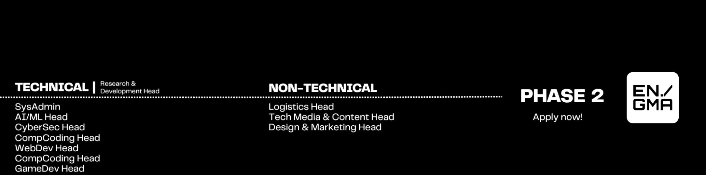
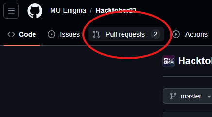

# Technical Head Hiring 2025-26

This document talks about the tasks involved for each leading role in the Enigma OC. These technical tasks have been curated by us to evaluate and understand what you can bring to the table if you were to be an Organising Committee member of Enigma. We evaluate your foundational technical understanding, implementation abilities, ability to tackle projects, and your ability to deal with realistic work while running and leading Enigma.

### General Points to Note
Some general points to note for any task, regardless of domain and focus, are:

Each task will have an in-depth discussion and questioning during the interview to ensure the legitimacy of your problem-solving skills and foundational theoretical understanding.

You are allowed to use any tool at your disposal — GenAI, online resources, etc. However, you are expected to be transparent about the resources you used from the perspective of future members/enthusiasts requiring the same resources for their learning or efficiency for the same project.

All the implementations of these tasks are **NOT** expected to be perfect, a simple prototype with the minimal requirements is sufficient.

Your project must be open-source and submitted on the Enigma Repository, please follow the submission guidelines here 

### What is the video demo?
For each task, all heads are required to submit a video demo which is in the view of explaining the project to a person/member who wishes to replicate, understand or work with you regarding this project you have worked on – a common scenario while working with a Computer Science community.

The video should be according to the stated requirements and cover the learning path, subject matter, resources, and project timeline. Demonstrate the project's functionality. While detailed concept explanations aren't needed, provide relevant resources. Discuss future learning prospects and potential implementations.


## General Guide for Contribution:

### 1. **Fork the Repository**
   - Navigate to the repository on GitHub.
   - Click the **Fork** button on the top right to create a copy of the repository under your GitHub account.
   - 


### 2. **Clone the Forked Repository to Your Local Machine**
   - Copy the URL of your forked repository (e.g., `https://github.com/<your_username>/Technical-OC-Hiring-2025`).
   - Open your terminal or command prompt and run the following command to clone the repo:
     ```bash
     git clone https://github.com/<your_username>/<repo_name>.git
     ```
   - Navigate into the project directory:
     ```bash
     cd <repo_name>
     ```

### 3. **Navigate to the Corresponding Task Directory**
   - Based on the task you're contributing to, navigate to the appropriate directory. For example:
     ```bash
     cd SYSCOM, cd AIML, cd RND
     ```

### 4. **Create a Folder Named After Your Roll Number**
   - Inside the specific task directory, create a folder named after your GitHub username to organize your submission:
     ```bash
     mkdir <SE24UARI201>
     ```

### Prepare Your Submission
Inside the personal folder you created, please add the following items:

<details>
<summary><strong>📁 Project Files</strong></summary>

- All your source code (.py, .ipynb, etc.).

- Any necessary assets like images, audio files, or data.

- A short .mp4 video demo of your project in action.

</details>

<details>
<summary><strong>📋 Requirements</strong></summary>

- A requirements.txt or environment.yml file listing all libraries needed to run your project.

- Documentation `readme.md`.

</details>

<details>
<summary><strong>📖 Documentation Contents</strong></summary>

- Project Overview: A detailed explanation of your project, your approach, and what it does.

- Setup and Usage: A step-by-step guide explaining how to install the requirements and run your code from start to finish.

</details>

### 6. **Stage Your Changes**
   - After adding all necessary files, use `git` to stage the changes:
     ```bash
     git add .
     ```

### 7. **Commit Your Changes**
   - Commit the changes with a descriptive message about your contribution:
     ```bash
     git commit -m "Added contribution for Level<X> : <task_name> by <your_username>"
     ```

### 8. **Push Your Changes to Your Forked Repository**
   - Push the changes to the `main` branch of your forked repository:
     ```bash
     git push origin main
     ```

### 9. **Open a Pull Request**



   - Navigate to the original repository on GitHub.
   - You’ll see a message prompting you to open a Pull Request (PR). Click on **Compare & pull request**.
   - Add a descriptive title and a comment explaining your contribution.
   - Submit the PR for review.

### 10. **Await Review:**
   - We will review your PR. They may request changes or approve it.
   - Engage respectfully and make necessary adjustments based on feedback.

### 11. Show up to the Interview :D


### **Checklist Before Submitting a Pull Request**
- [ ] Have you forked and cloned the repository?
- [ ] Did you create a directory with your GitHub username?
- [ ] Did you include all necessary files for your contribution (images, audio, text files, etc.)?
- [ ] Did you specify tools, models, prompts, or methodologies in a text file?
- [ ] Did you push your changes to your forked repository?
- [ ] Have you opened a pull request with a descriptive title and comment?

---


